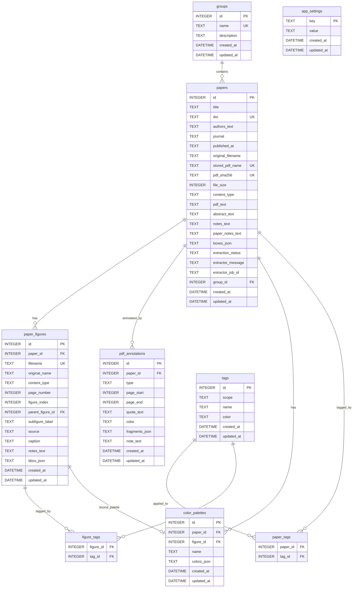

# CiteBox 数据库说明

本文档描述当前项目使用的 SQLite 数据库结构、实体关系、建表语句、字段用途，以及后续扩展时推荐的建模方式。

## 概览

- 数据库类型：SQLite
- 主要业务表：`groups`、`papers`、`pdf_annotations`、`paper_figures`、`color_palettes`、`tags`
- 关系表：`paper_tags`、`figure_tags`
- 配置表：`app_settings`
- 全文检索：`papers_fts`、`figures_fts`（FTS5，`trigram` tokenizer）

## ER 图


```mermaid
erDiagram
    groups ||--o{ papers : contains
    papers ||--o{ paper_figures : has
    papers ||--o{ pdf_annotations : annotated_by
    papers ||--o{ color_palettes : has
    papers ||--o{ paper_tags : tagged_by
    tags ||--o{ paper_tags : applied_to
    paper_figures ||--o{ figure_tags : tagged_by
    paper_figures ||--o| color_palettes : bound_palette
    tags ||--o{ figure_tags : applied_to

    groups {
        INTEGER id PK
        TEXT name UK
        TEXT description
        DATETIME created_at
        DATETIME updated_at
    }

    papers {
        INTEGER id PK
        TEXT title
        TEXT doi UK
        TEXT authors_text
        TEXT journal
        TEXT published_at
        TEXT original_filename
        TEXT stored_pdf_name UK
        TEXT pdf_sha256 UK
        INTEGER file_size
        TEXT content_type
        TEXT pdf_text
        TEXT abstract_text
        TEXT notes_text
        TEXT paper_notes_text
        TEXT boxes_json
        TEXT extraction_status
        TEXT extractor_message
        TEXT extractor_job_id
        INTEGER group_id FK
        DATETIME created_at
        DATETIME updated_at
    }

    paper_figures {
        INTEGER id PK
        INTEGER paper_id FK
        TEXT filename UK
        TEXT original_name
        TEXT content_type
        INTEGER page_number
        INTEGER figure_index
        INTEGER parent_figure_id FK
        TEXT subfigure_label
        TEXT source
        TEXT caption
        TEXT notes_text
        TEXT bbox_json
        DATETIME created_at
        DATETIME updated_at
    }

    pdf_annotations {
        INTEGER id PK
        INTEGER paper_id FK
        TEXT type
        INTEGER page_start
        INTEGER page_end
        TEXT quote_text
        TEXT color
        TEXT fragments_json
        TEXT note_text
        DATETIME created_at
        DATETIME updated_at
    }

    tags {
        INTEGER id PK
        TEXT scope
        TEXT name
        TEXT color
        DATETIME created_at
        DATETIME updated_at
    }

    paper_tags {
        INTEGER paper_id FK
        INTEGER tag_id FK
    }

    figure_tags {
        INTEGER figure_id FK
        INTEGER tag_id FK
    }

    color_palettes {
        INTEGER id PK
        INTEGER paper_id FK
        INTEGER figure_id FK
        TEXT name
        TEXT colors_json
        DATETIME created_at
        DATETIME updated_at
    }

    app_settings {
        TEXT key PK
        TEXT value
        DATETIME created_at
        DATETIME updated_at
    }
```

说明：

- `tags.scope` 用来区分文献标签和图片标签，当前允许值为 `paper` / `figure`
- `papers.notes_text` 是文献级管理笔记，适合保存迁移说明、整理备注和管理信息
- `papers.paper_notes_text` 是文献级内容笔记，适合保存 AI伴读结果、阅读结论和结构化摘要
- `paper_figures.notes_text` 是图片级笔记，用于图片库、笔记页和全文检索
- `pdf_annotations` 保存 PDF 阅读器内的持久高亮，随文献删除级联删除
- `color_palettes` 把一组配色绑定到某张具体图片；当前前端只允许对子图提取配色，因此它天然能回溯到来源大图和原始文献
- `app_settings` 当前除了提取器配置外，也会保存 `ai_settings`、`weixin_binding`、`weixin_bridge_settings`、`integration_settings`（内置 MCP 服务的开关与端口）以及角色 Prompt 等 JSON 设置项；历史上的 `ai_prompt_presets` 键现在承载角色 Prompt 数据
- 历史升级时，旧的 `papers.notes_text` 会迁移到 `papers.paper_notes_text`，避免原有 AI 内容继续混在管理笔记里
- `papers_fts` / `figures_fts` 是全文索引表，不是业务真表

## 当前建表 SQL

```sql
CREATE TABLE groups (
    id INTEGER PRIMARY KEY AUTOINCREMENT,
    name TEXT NOT NULL COLLATE NOCASE UNIQUE,
    description TEXT DEFAULT '',
    created_at DATETIME DEFAULT CURRENT_TIMESTAMP,
    updated_at DATETIME DEFAULT CURRENT_TIMESTAMP
);

CREATE TABLE tags (
    id INTEGER PRIMARY KEY AUTOINCREMENT,
    scope TEXT NOT NULL DEFAULT 'paper' CHECK (scope IN ('paper', 'figure')),
    name TEXT NOT NULL COLLATE NOCASE,
    color TEXT DEFAULT '#A45C40',
    created_at DATETIME DEFAULT CURRENT_TIMESTAMP,
    updated_at DATETIME DEFAULT CURRENT_TIMESTAMP,
    UNIQUE(scope, name)
);

CREATE TABLE app_settings (
    key TEXT PRIMARY KEY,
    value TEXT NOT NULL DEFAULT '',
    created_at DATETIME DEFAULT CURRENT_TIMESTAMP,
    updated_at DATETIME DEFAULT CURRENT_TIMESTAMP
);

CREATE TABLE papers (
    id INTEGER PRIMARY KEY AUTOINCREMENT,
    title TEXT NOT NULL,
    doi TEXT DEFAULT '',
    authors_text TEXT DEFAULT '',
    journal TEXT DEFAULT '',
    published_at TEXT DEFAULT '',
    original_filename TEXT NOT NULL,
    stored_pdf_name TEXT NOT NULL,
    pdf_sha256 TEXT DEFAULT '',
    file_size INTEGER DEFAULT 0,
    content_type TEXT DEFAULT 'application/pdf',
    pdf_text TEXT DEFAULT '',
    pdf_page_texts TEXT,
    abstract_text TEXT DEFAULT '',
    notes_text TEXT DEFAULT '',
    paper_notes_text TEXT DEFAULT '',
    boxes_json TEXT DEFAULT '',
    extraction_status TEXT DEFAULT 'completed'
        CHECK (extraction_status IN ('queued', 'running', 'manual_pending', 'completed', 'failed', 'cancelled')),
    extractor_message TEXT DEFAULT '',
    extractor_job_id TEXT DEFAULT '',
    group_id INTEGER REFERENCES groups(id) ON DELETE SET NULL,
    created_at DATETIME DEFAULT CURRENT_TIMESTAMP,
    updated_at DATETIME DEFAULT CURRENT_TIMESTAMP
);

CREATE TABLE paper_tags (
    paper_id INTEGER NOT NULL REFERENCES papers(id) ON DELETE CASCADE,
    tag_id INTEGER NOT NULL REFERENCES tags(id) ON DELETE CASCADE,
    PRIMARY KEY (paper_id, tag_id)
);

CREATE TABLE pdf_annotations (
    id INTEGER PRIMARY KEY AUTOINCREMENT,
    paper_id INTEGER NOT NULL REFERENCES papers(id) ON DELETE CASCADE,
    type TEXT NOT NULL DEFAULT 'highlight' CHECK (type IN ('highlight')),
    page_start INTEGER NOT NULL DEFAULT 1,
    page_end INTEGER NOT NULL DEFAULT 1,
    quote_text TEXT NOT NULL DEFAULT '',
    color TEXT NOT NULL DEFAULT 'yellow',
    fragments_json TEXT NOT NULL DEFAULT '[]',
    note_text TEXT NOT NULL DEFAULT '',
    created_at DATETIME DEFAULT CURRENT_TIMESTAMP,
    updated_at DATETIME DEFAULT CURRENT_TIMESTAMP
);

CREATE TABLE paper_figures (
    id INTEGER PRIMARY KEY AUTOINCREMENT,
    paper_id INTEGER NOT NULL REFERENCES papers(id) ON DELETE CASCADE,
    filename TEXT NOT NULL,
    original_name TEXT DEFAULT '',
    content_type TEXT DEFAULT '',
    page_number INTEGER DEFAULT 0,
    figure_index INTEGER DEFAULT 0,
    parent_figure_id INTEGER REFERENCES paper_figures(id) ON DELETE CASCADE,
    subfigure_label TEXT DEFAULT '',
    source TEXT DEFAULT 'auto' CHECK (source IN ('auto', 'manual')),
    caption TEXT DEFAULT '',
    notes_text TEXT DEFAULT '',
    bbox_json TEXT DEFAULT '',
    created_at DATETIME DEFAULT CURRENT_TIMESTAMP,
    updated_at DATETIME DEFAULT CURRENT_TIMESTAMP
);

CREATE TABLE figure_tags (
    figure_id INTEGER NOT NULL REFERENCES paper_figures(id) ON DELETE CASCADE,
    tag_id INTEGER NOT NULL REFERENCES tags(id) ON DELETE CASCADE,
    PRIMARY KEY (figure_id, tag_id)
);

CREATE TABLE color_palettes (
    id INTEGER PRIMARY KEY AUTOINCREMENT,
    paper_id INTEGER NOT NULL REFERENCES papers(id) ON DELETE CASCADE,
    figure_id INTEGER NOT NULL UNIQUE REFERENCES paper_figures(id) ON DELETE CASCADE,
    name TEXT DEFAULT '',
    colors_json TEXT NOT NULL DEFAULT '[]',
    created_at DATETIME DEFAULT CURRENT_TIMESTAMP,
    updated_at DATETIME DEFAULT CURRENT_TIMESTAMP
);

CREATE VIRTUAL TABLE papers_fts USING fts5(
    title,
    original_filename,
    abstract_text,
    notes_text,
    pdf_text,
    tokenize='trigram'
);

CREATE VIRTUAL TABLE figures_fts USING fts5(
    original_name,
    caption,
    notes_text,
    tokenize='trigram'
);
```

### 关键索引

```sql
CREATE INDEX idx_papers_group_id ON papers(group_id);
CREATE INDEX idx_papers_created_at ON papers(created_at);
CREATE INDEX idx_papers_status ON papers(extraction_status);
CREATE UNIQUE INDEX idx_papers_stored_pdf_name_unique ON papers(stored_pdf_name);
CREATE UNIQUE INDEX idx_papers_doi_unique ON papers(doi) WHERE COALESCE(TRIM(doi), '') <> '';
CREATE UNIQUE INDEX idx_papers_pdf_sha256_unique ON papers(pdf_sha256) WHERE COALESCE(TRIM(pdf_sha256), '') <> '';

CREATE INDEX idx_pdf_annotations_paper_id ON pdf_annotations(paper_id, id);
CREATE INDEX idx_pdf_annotations_paper_page ON pdf_annotations(paper_id, page_start, page_end);

CREATE INDEX idx_paper_figures_paper_id ON paper_figures(paper_id);
CREATE INDEX idx_paper_figures_updated_at ON paper_figures(updated_at);
CREATE INDEX idx_paper_figures_parent_figure_id ON paper_figures(parent_figure_id);
CREATE UNIQUE INDEX idx_paper_figures_filename_unique ON paper_figures(filename);
CREATE UNIQUE INDEX idx_paper_figures_parent_label_unique
    ON paper_figures(parent_figure_id, subfigure_label)
    WHERE parent_figure_id IS NOT NULL AND COALESCE(TRIM(subfigure_label), '') <> '';

CREATE INDEX idx_color_palettes_paper_id ON color_palettes(paper_id);
CREATE INDEX idx_paper_tags_tag_id ON paper_tags(tag_id);
CREATE INDEX idx_figure_tags_tag_id ON figure_tags(tag_id);

CREATE INDEX idx_tags_scope ON tags(scope);
CREATE UNIQUE INDEX idx_tags_scope_name ON tags(scope, name);
```

### 关键触发器

- 校验触发器：
  - 限制 `tags.scope`
  - 限制 `papers.extraction_status`
  - 限制 `paper_figures.source`
  - 限制子图必须带 `subfigure_label`
  - 限制子图只能挂在同一篇文献的一级大图下
- FTS 同步触发器：
  - `papers` 的增删改会同步 `papers_fts`
  - `paper_figures` 的增删改会同步 `figures_fts`

## 字段用途说明

### `groups`

| 字段 | 用途 |
| --- | --- |
| `id` | 分组主键 |
| `name` | 分组名称，大小写不敏感唯一 |
| `description` | 分组说明 |
| `created_at` | 创建时间 |
| `updated_at` | 最近修改时间 |

### `app_settings`

| 字段 | 用途 |
| --- | --- |
| `key` | 设置项名称，例如 `ai_settings`、`weixin_binding`、`weixin_bridge_settings`、`integration_settings`（内置 MCP 服务的开关与端口）、历史兼容键 `ai_prompt_presets`、提取器配置项 |
| `value` | 对应设置的字符串或 JSON 内容 |
| `created_at` | 创建时间 |
| `updated_at` | 最近修改时间 |

### `papers`

| 字段 | 用途 |
| --- | --- |
| `id` | 文献主键 |
| `title` | 文献标题 |
| `doi` | 标准化后的 DOI；支持通过 DOI 导入 Open Access PDF，并对非空值要求唯一 |
| `authors_text` | 结构化作者字符串；优先由 DOI 元数据自动补全，也允许手动修正 |
| `journal` | 期刊名、会议名或来源名；优先由 DOI 元数据自动补全 |
| `published_at` | 发表日期字符串；支持保存 `YYYY`、`YYYY-MM` 或 `YYYY-MM-DD` |
| `original_filename` | 上传时的原始 PDF 文件名 |
| `stored_pdf_name` | 存储目录里的实际 PDF 文件名，当前要求唯一 |
| `pdf_sha256` | PDF 内容指纹，用于上传去重；仅对非空值要求唯一 |
| `file_size` | 文件大小 |
| `content_type` | MIME 类型，默认 `application/pdf` |
| `pdf_text` | PDF 提取出的全文文本；也允许手动整理为 Markdown，主要用于检索、AI伴读和原文预览 |
| `pdf_page_texts` | 逐页 PDF 文本，JSON 字符串数组，可空；由浏览器端 pdf.js 提取流程随 `pdf_text` 一并写入（经 `ensureColumn` 增量迁移加入） |
| `abstract_text` | 文献摘要 |
| `notes_text` | 文献级管理笔记；适合保存整理说明、迁移备注、归档提示 |
| `paper_notes_text` | 文献级内容笔记；适合保存 AI伴读结果、阅读结论和 Markdown 笔记 |
| `boxes_json` | 提取框、版面分析等结构化 JSON |
| `extraction_status` | 自动解析状态，当前允许 `queued/running/manual_pending/completed/failed/cancelled`；其中 `manual_pending` 仅保留给历史兼容数据 |
| `extractor_message` | 解析流程的状态说明或错误信息 |
| `extractor_job_id` | 外部提取服务的任务 ID |
| `group_id` | 所属分组，可为空 |
| `created_at` | 创建时间 |
| `updated_at` | 最近修改时间，文献元数据、标签、解析状态变化都会更新 |

### `paper_figures`

| 字段 | 用途 |
| --- | --- |
| `id` | 图片主键 |
| `paper_id` | 所属文献 ID |
| `filename` | 存储目录里的实际图片文件名，当前要求唯一 |
| `original_name` | 原始图片名或导入名 |
| `content_type` | 图片 MIME 类型 |
| `page_number` | 来源页码 |
| `figure_index` | 同页内排序编号 |
| `parent_figure_id` | 父图 ID；为空表示一级大图，不为空表示这是某张大图下的子图区域 |
| `subfigure_label` | 子图后缀，例如 `a` / `b` / `c`；仅对子图有意义 |
| `source` | 图片来源，当前允许 `auto/manual` |
| `caption` | 图片标题或图注 |
| `notes_text` | 图片级笔记；适合保存 AI 解读结果、摘录和人工说明 |
| `bbox_json` | 图片框坐标或定位信息；一级图通常记录 PDF 页面定位，子图通常记录相对父图的裁切区域 |
| `created_at` | 图片记录创建时间 |
| `updated_at` | 图片最近修改时间；笔记、标签更新时会刷新 |

### `pdf_annotations`

PDF 阅读器内的持久标注表。当前第一版只保存黄色高亮，不保存评论、搜索索引或同步状态。

| 字段 | 用途 |
| --- | --- |
| `id` | PDF 标注主键 |
| `paper_id` | 所属文献 ID，随文献删除级联删除 |
| `type` | 标注类型，当前固定为 `highlight` |
| `page_start` | 服务端按片段计算出的起始页码 |
| `page_end` | 服务端按片段计算出的结束页码 |
| `quote_text` | 划选原文，服务层限制最多 10,000 字符 |
| `color` | 高亮颜色，当前固定为 `yellow` |
| `fragments_json` | 归一化页面矩形数组，例如 `[{"page":3,"left":0.12,"top":0.34,"width":0.28,"height":0.018}]` |
| `note_text` | 预留评论字段，当前为空字符串 |
| `created_at` | 标注创建时间 |
| `updated_at` | 标注最近更新时间 |

### `tags`

| 字段 | 用途 |
| --- | --- |
| `id` | 标签主键 |
| `scope` | 标签作用域，`paper` 表示文献标签，`figure` 表示图片标签 |
| `name` | 标签名；在同一作用域内唯一 |
| `color` | 标签颜色 |
| `created_at` | 创建时间 |
| `updated_at` | 最近修改时间 |

### `paper_tags`

| 字段 | 用途 |
| --- | --- |
| `paper_id` | 文献 ID |
| `tag_id` | 标签 ID |

### `figure_tags`

| 字段 | 用途 |
| --- | --- |
| `figure_id` | 图片 ID |
| `tag_id` | 标签 ID |

### `color_palettes`

| 字段 | 用途 |
| --- | --- |
| `id` | 配色主键 |
| `paper_id` | 来源文献 ID；方便配色库按文献或分组检索 |
| `figure_id` | 绑定的图片 ID；当前要求唯一，表示“一张图最多一组当前配色” |
| `name` | 配色名称；默认会按图片标签生成，如 `Fig 1a 配色` |
| `colors_json` | 颜色数组 JSON，格式为 `["#RRGGBB", ...]` |
| `created_at` | 创建时间 |
| `updated_at` | 最近修改时间 |

### `app_settings`

| 字段 | 用途 |
| --- | --- |
| `key` | 配置项键名 |
| `value` | 配置项 JSON 或字符串值 |
| `created_at` | 创建时间 |
| `updated_at` | 最近修改时间 |

## 检索设计说明

当前检索分成两层：

1. 结构化过滤
   - `group_id`
   - `tag_id`
   - `extraction_status`
   - `has_notes`
   - `has_paper_notes`

2. 全文搜索
   - `papers_fts` 覆盖：`title`、`original_filename`、`abstract_text`、`notes_text`、`pdf_text`
   - `papers.paper_notes_text` 当前通过普通列匹配参与搜索和筛选，还没有独立 FTS 列
   - `papers.doi`、`papers.authors_text`、`papers.journal`、`papers.published_at` 当前作为结构化元数据保存，还没有加入 FTS；后续如果需要按这些字段直接检索，可再扩展
   - `figures_fts` 覆盖：`original_name`、`caption`、`notes_text`
   - 标签名和分组名仍然通过普通表查询完成

为什么用 `trigram`：

- 对中英文混合检索更稳
- 支持子串匹配，比简单 `LIKE '%keyword%'` 更适合全文检索
- 仍然保留 SQLite 单文件部署的优点

## 这套设计目前为什么合理

- `papers` 和 `paper_figures` 分离，符合“一篇文献有多张图片”的自然关系
- `paper_figures.parent_figure_id` 让图片支持两级结构：一级大图 + 子图区域
- 子图当前只保存裁剪区域元数据；展示图像按需从父图动态裁剪，不再单独生成子图文件
- `color_palettes.figure_id` 让配色直接绑定到图片，不会出现“配色脱离来源子图”的漂移问题
- 标签通过 `scope + relation table` 拆成文献标签和图片标签，职责清楚
- 管理笔记、文献笔记、图片笔记已经分层，不再把 AI 伴读结果继续塞回管理备注
- `updated_at` 已补到 `paper_figures`，后续能支持“最近编辑的图片笔记”这类视图
- 继续保持 SQLite 单文件模式，适合本地客户端 / 桌面应用

## 未来拓展建议

### 1. 当前的单篇笔记模型

适用场景：

- `papers.notes_text` 保存管理笔记
- `papers.paper_notes_text` 保存单篇文献的一份内容笔记
- `paper_figures.notes_text` 保存单张图片的一份内容笔记
- 不需要版本历史
- 不需要多人协作

### 2. 如果要支持“一个 paper 多条文献笔记”

这时不建议继续往 `papers` 上加 `note_1`、`note_2` 之类列，而应该单独建表：

```sql
CREATE TABLE paper_notes (
    id INTEGER PRIMARY KEY AUTOINCREMENT,
    paper_id INTEGER NOT NULL REFERENCES papers(id) ON DELETE CASCADE,
    note_type TEXT NOT NULL DEFAULT 'general',
    title TEXT DEFAULT '',
    content TEXT NOT NULL DEFAULT '',
    format TEXT NOT NULL DEFAULT 'markdown',
    source TEXT NOT NULL DEFAULT 'user',
    created_at DATETIME DEFAULT CURRENT_TIMESTAMP,
    updated_at DATETIME DEFAULT CURRENT_TIMESTAMP
);

CREATE INDEX idx_paper_notes_paper_id ON paper_notes(paper_id);
CREATE INDEX idx_paper_notes_updated_at ON paper_notes(updated_at);
```

推荐这样设计的原因：

- 一篇文献可以有多条笔记
- 可以区分 `general`、`summary`、`ai_summary`、`reading_log`
- 可以保留更新时间和来源
- 后续如果要做版本、收藏、归档，不用再改 `papers` 主表

如果还要做全文检索，再补一张 FTS 表：

```sql
CREATE VIRTUAL TABLE paper_notes_fts USING fts5(
    title,
    content,
    tokenize='trigram'
);
```

### 3. 如果要支持“图片笔记历史”或“多条图片笔记”

当前 `paper_figures.notes_text` 适合单条当前笔记。

如果未来需要：

- 一张图多条笔记
- AI 解读和人工结论分开
- 笔记版本历史

建议同样拆表：

```sql
CREATE TABLE figure_notes (
    id INTEGER PRIMARY KEY AUTOINCREMENT,
    figure_id INTEGER NOT NULL REFERENCES paper_figures(id) ON DELETE CASCADE,
    note_type TEXT NOT NULL DEFAULT 'general',
    content TEXT NOT NULL DEFAULT '',
    format TEXT NOT NULL DEFAULT 'markdown',
    source TEXT NOT NULL DEFAULT 'user',
    created_at DATETIME DEFAULT CURRENT_TIMESTAMP,
    updated_at DATETIME DEFAULT CURRENT_TIMESTAMP
);
```

### 4. 如果未来要支持一个 paper 属于多个 group

当前模型是：

- 一个 paper 只能挂一个 `group_id`

如果以后要支持多归类，应改成关系表，而不是继续在 `papers` 上加更多 group 列：

```sql
CREATE TABLE paper_groups (
    paper_id INTEGER NOT NULL REFERENCES papers(id) ON DELETE CASCADE,
    group_id INTEGER NOT NULL REFERENCES groups(id) ON DELETE CASCADE,
    PRIMARY KEY (paper_id, group_id)
);
```

### 5. 如果未来要做审计 / 时间线

建议新增统一事件表，而不是依赖各表的 `updated_at`：

```sql
CREATE TABLE entity_events (
    id INTEGER PRIMARY KEY AUTOINCREMENT,
    entity_type TEXT NOT NULL,
    entity_id INTEGER NOT NULL,
    event_type TEXT NOT NULL,
    payload_json TEXT DEFAULT '',
    created_at DATETIME DEFAULT CURRENT_TIMESTAMP
);
```

适用场景：

- 谁给哪张图加了什么标签
- 哪篇文献什么时候被重新解析
- 哪张图的笔记被 AI 写入过什么内容

## AI 会话统一层（surface unification, 2026-05）

`ai_conversations` 增加了三列以支持桌面端和微信端共用同一套会话引擎：

- `surface_origin TEXT NOT NULL DEFAULT 'web'` — 创建会话的来源：`'wechat'` / `'web'` / `'desktop'`
- `kind TEXT NOT NULL DEFAULT 'default_web'` — 会话角色：`'main_wechat'`（每个绑定用户唯一）/ `'default_web'`（Web 默认会话）/ `'ad_hoc'`（任何具名会话）
- `clear_barrier_turn_id INTEGER` — `/clear` 屏障；后续历史只读取 `id > clear_barrier_turn_id` 的 turn

部分唯一索引 `idx_ai_conv_main_wechat` 限定 `kind = 'main_wechat'` 全表只允许一行（单租户简化；多租户化时改为 `(user_id, kind)`）。

完整的 AI 会话表族（`ai_conversations`、`ai_messages`、`ai_conversation_papers`、`ai_turn_runs`、`ai_tool_calls`、`ai_result_cards`）定义在 `internal/repository/schema/schema.go`；该文件用 `ensureColumn` 实现增量列迁移，`ensureConversationSurfaceColumns` 是这次新增的。

### `ai_generated_images`

存储 AI 生成的 graphical abstract 图片元数据。PNG 文件本身保存在磁盘的 `<storage_dir>/ai_generated/<conversation_id>/` 目录下。

父表 `ai_turn_runs` 或 `ai_conversations` 删除时级联删除对应记录。

| 字段 | 类型 | 说明 |
| --- | --- | --- |
| `id` | INTEGER PK | 自增主键 |
| `turn_run_id` | INTEGER FK | `ai_turn_runs(id) ON DELETE CASCADE` |
| `conversation_id` | INTEGER FK | `ai_conversations(id) ON DELETE CASCADE` |
| `file_path` | TEXT | 相对于 `<storage_dir>/ai_generated` 的文件路径 |
| `prompt` | TEXT | 视觉理解阶段生成的图片 Prompt |
| `model` | TEXT | 图片生成 API 模型，例如 `gpt-image-2` |
| `size` | TEXT | 图片尺寸，例如 `1024x1024` |
| `quality` | TEXT | 图片质量，例如 `high` |
| `source_paper_ids` | TEXT | JSON int64 数组，默认 `[]` |
| `source_figure_ids` | TEXT | JSON int64 数组，默认 `[]` |
| `cost_estimate_usd` | REAL | 费用估算，可为空 |
| `created_at` | DATETIME | 服务器时间 |

索引：`idx_ai_generated_images_conv (conversation_id, id)` 和 `idx_ai_generated_images_turn (turn_run_id)`。

## 外部集成（research-context integration, 2026-08）

### `integration_tokens`

外部集成访问令牌，数据库只保存令牌哈希，不保存明文。由 `internal/repository/schema/schema.go` 的 `ensureIntegrationSchema` 创建。

| 字段 | 类型 | 说明 |
| --- | --- | --- |
| `id` | INTEGER PK | 自增主键 |
| `name` | TEXT | 令牌名称，默认 `''` |
| `token_hash` | TEXT UNIQUE | 令牌明文（`cbx_` 前缀）的 SHA-256 哈希，小写十六进制 |
| `scopes` | TEXT | 权限范围，JSON 字符串数组，默认 `'[]'` |
| `created_at` | DATETIME | 创建时间 |
| `last_used_at` | DATETIME | 最近使用时间，可空 |
| `revoked_at` | DATETIME | 吊销时间，可空；非空即视为已吊销 |

索引：`idx_integration_tokens_token_hash (token_hash)`。

### 增量同步查询

`papers` / `paper_figures` / `pdf_annotations` 提供按 `(updated_at, id)` 的 keyset 增量查询（`ListPapersChangedSince`、`ListFiguresChangedSince`、`ListPDFAnnotationsChangedSince`），供外部集成做增量拉取。`updated_at` 是秒级精度的 UTC 字符串，相同时间戳的记录靠 `id` 续页，调用方需保存最后一条记录的 `(updated_at, id)` 作为下一次的游标。

## 当前最值得坚持的建模原则

- 主实体和扩展实体分开：不要把一切都塞进 `papers`
- 单值状态放主表，多值记录拆成子表
- 检索文本和业务关系分开：业务表存真值，FTS 表存索引
- 先保留 SQLite 单机优势，再按需求增加专门的关系表
